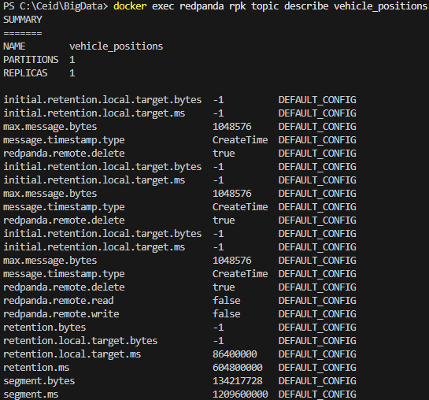
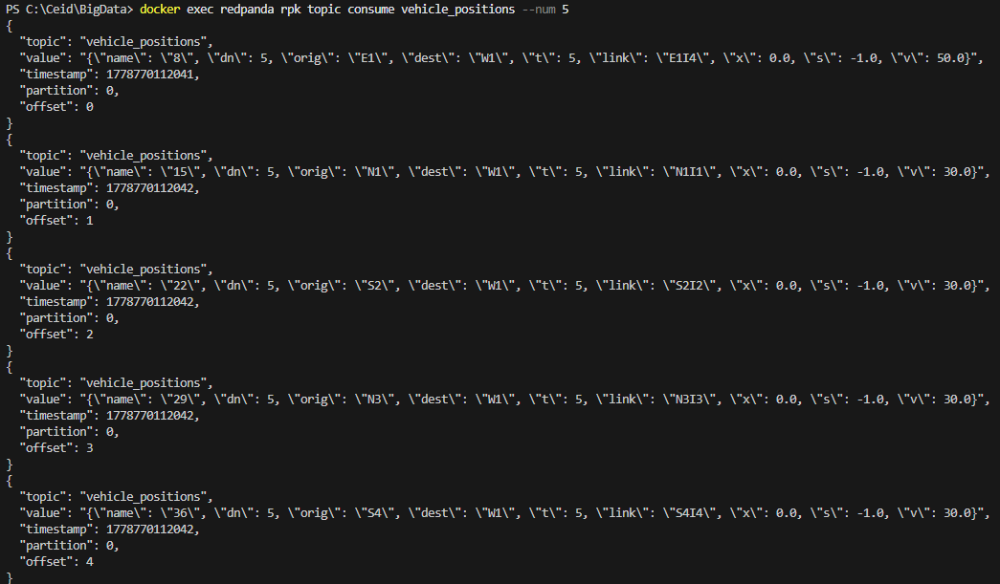
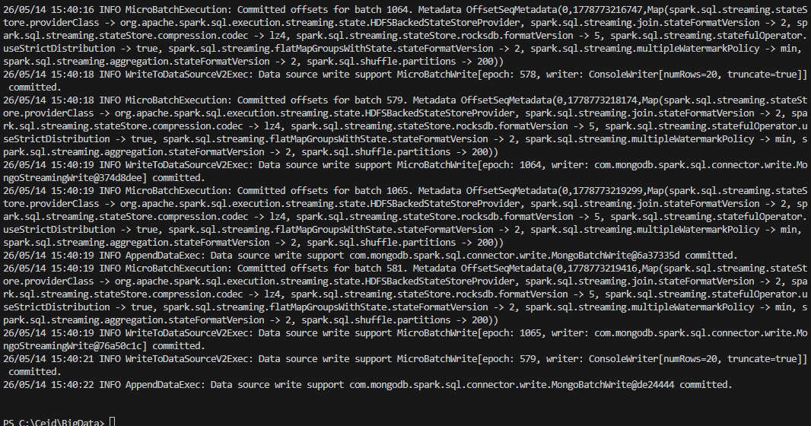
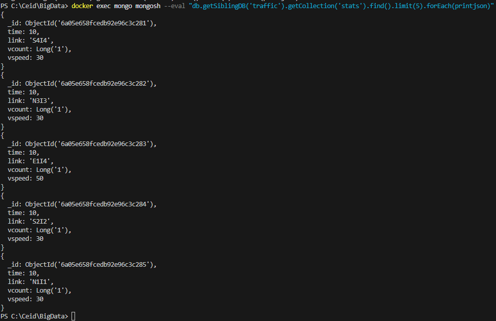
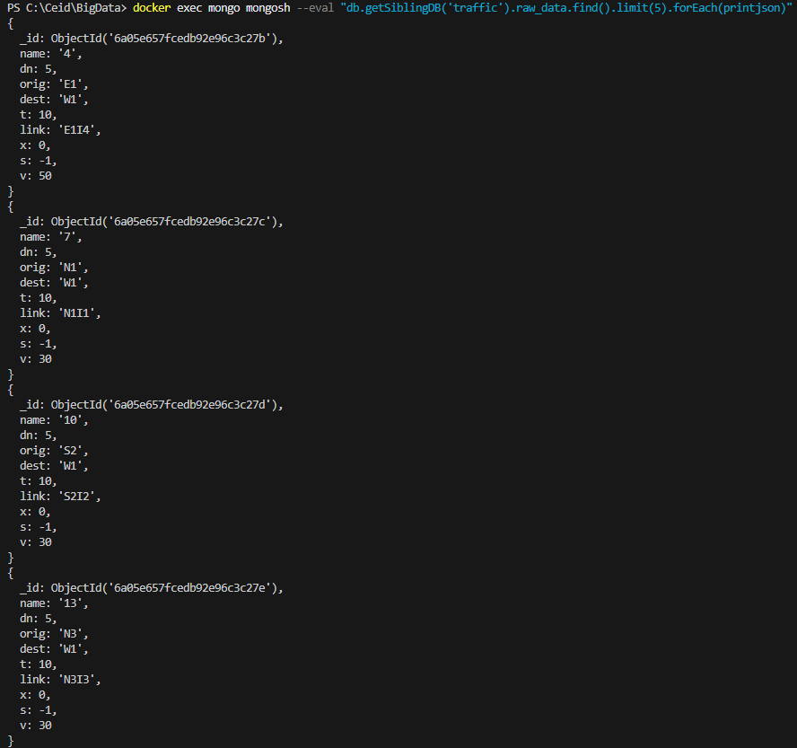
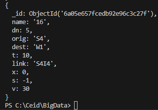
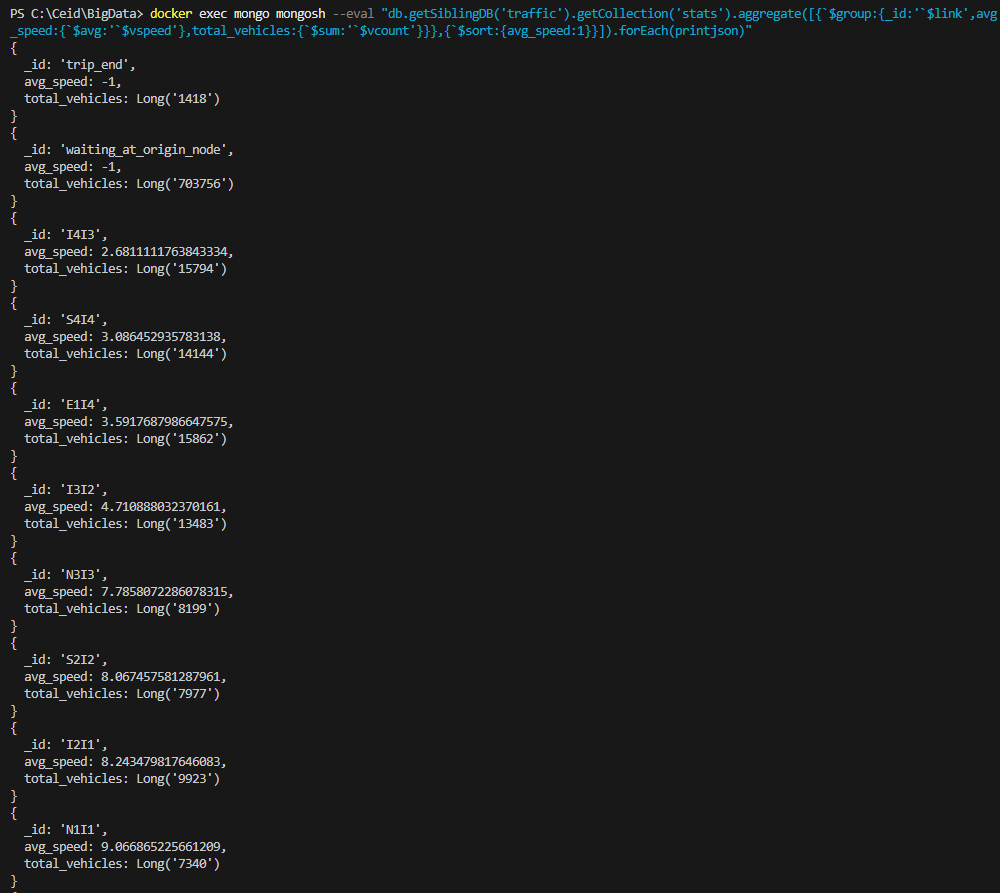
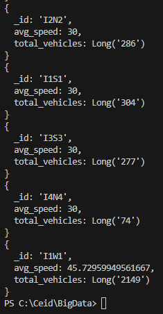

# ΠΑΝΕΠΙΣΤΗΜΙΟ ΠΑΤΡΩΝ
## ΤΜΗΜΑ ΜΗΧΑΝΙΚΩΝ Η/Υ ΚΑΙ ΠΛΗΡΟΦΟΡΙΚΗΣ
### Μάθημα: Συστήματα Διαχείρισης Μεγάλων Δεδομένων (CEID_NE4348)
**Υπεύθυνοι Καθηγητές:** Βασίλειος Μεγαλοοικονόμου, Ευαγγελία Ζαχαράκη

---

# ΤΕΛΙΚΗ ΑΝΑΦΟΡΑ PROJECT: Επεξεργασία Δεδομένων Ροής με Kafka, Spark και MongoDB

**Ημερομηνία Παράδοσης:** 15/06/2026  
**Φοιτητής/Ομάδα:** Κωνσταντίνος Κολυβράς  
**MachineGuid (OS):** `ebbd3b1f-289c-480e-83c6-a1dd2d1a1c04`

---

## 1. Εισαγωγή και Αρχιτεκτονική Συστήματος

Στόχος της παρούσας εργασίας είναι η σχεδίαση και υλοποίηση μιας ολοκληρωμένης pipeline επεξεργασίας δεδομένων ροής σε πραγματικό χρόνο (real-time stream processing). Η αρχιτεκτονική του συστήματος αποτελείται από τέσσερα βασικά επίπεδα:
1. **Παραγωγή Δεδομένων (Data Producer / Simulation)**: Χρήση του εξομοιωτή κυκλοφορίας **UXSIM** σε Python για την παραγωγή δεδομένων κίνησης οχημάτων σε ένα οδικό δίκτυο.
2. **Μεταφορά Δεδομένων (Message Broker)**: Χρήση του **Redpanda** (ενός σύγχρονου broker συμβατού με το Kafka wire protocol) για την προσωρινή αποθήκευση και αξιόπιστη δρομολόγηση των μηνυμάτων ροής στο topic `vehicle_positions`.
3. **Επεξεργασία Ροής (Stream Processing)**: Χρήση του **Apache Spark (PySpark) Structured Streaming** για την κατανάλωση των δεδομένων από το Redpanda, το φιλτράρισμα, τον μετασχηματισμό τους με βάση συγκεκριμένο σχήμα (Schema) και τον υπολογισμό στατιστικών στοιχείων (groupBy ανά time και link).
4. **Αποθήκευση Δεδομένων (NoSQL Database)**: Χρήση της **MongoDB** για την αποθήκευση τόσο των ακατέργαστων (raw_data) όσο και των επεξεργασμένων στατιστικών (stats) δεδομένων.

Η ροή των δεδομένων απεικονίζεται διαγραμματικά παρακάτω:

```mermaid
graph LR
    UXSIM[Εξομοιωτής UXSIM] -->|Παραγωγή snapshot & Φιλτράρισμα v > 0| Producer[Python Producer]
    Producer -->|JSON Records (localhost:19092)| Redpanda[Redpanda Broker]
    Redpanda -->|Stream (redpanda:9092)| Spark[Spark Structured Streaming]
    Spark -->|Αποθήκευση Raw| MongoRaw[(MongoDB: traffic.raw_data)]
    Spark -->|Υπολογισμός stats & ForeachBatch| MongoStats[(MongoDB: traffic.stats)]
    Spark -->|Debugging Output| Console[Console Sink]
```

---

## 2. Σχεδιαστικές Επιλογές και Δομή Δεδομένων

### 2.1. Εξομοιωτής UXSIM και Παραγωγή Δεδομένων
Ο εξομοιωτής UXSIM χρησιμοποιήθηκε για τη δημιουργία ενός δικτύου τύπου πλέγματος (4×4 grid) με 4 εσωτερικούς κόμβους (διασταυρώσεις με φωτεινούς σηματοδότες `I1`, `I2`, `I3`, `I4`), εξωτερικούς κόμβους εισόδου/εξόδου (`W1`, `E1`, `N1-N4`, `S1-S4`) και αντίστοιχες συνδετικές ακμές (links) με 3 λωρίδες κυκλοφορίας και ελεύθερη ταχύτητα ροής 50 km/h (για την κατεύθυνση East-West) ή 30 km/h (για τις κατευθύνσεις North-South).
Η ζήτηση (demand) οχημάτων εισάγεται τυχαία κάθε 30 δευτερόλεπτα.

Τα δεδομένα κάθε οχήματος εξάγονται μέσω της συνάρτησης `W.analyzer.vehicles_to_pandas()` σε ένα DataFrame με τις εξής βασικές στήλες:
* `t`: Η χρονική στιγμή της εξομοίωσης (double).
* `veh`: Το αναγνωριστικό του οχήματος (string).
* `link`: Η ακμή (δρόμος) στην οποία βρίσκεται το όχημα (string).
* `x`: Η θέση του οχήματος κατά μήκος της ακμής (double).
* `v`: Η τρέχουσα ταχύτητα του οχήματος (double).

### 2.2. Broker (Redpanda)
Επιλέχθηκε το **Redpanda** ως εναλλακτική λύση του κλασικού Kafka. Το Redpanda είναι γραμμένο σε C++, δεν απαιτεί JVM ή Zookeeper/KRaft για τοπική εκτέλεση, με αποτέλεσμα να είναι εξαιρετικά ελαφρύ, γρήγορο και εύκολο στη διαχείριση μέσω Docker. 

### 2.3. Επεξεργασία & Schema στο Spark
Ο καταναλωτής Spark Structured Streaming ορίζει ρητά το σχήμα (Schema) των εισερχόμενων JSON μηνυμάτων για την αποφυγή απώλειας τύπων δεδομένων:
* `name`: StringType
* `dn`: IntegerType
* `orig`, `dest`: StringType
* `t` (μετονομάζεται σε `time` κατά το groupBy): DoubleType
* `link`: StringType
* `x`, `s`, `v`: DoubleType

Υπολογίζονται τα εξής στατιστικά ανά ακμή (`link`) και χρόνο (`time`):
* `vcount`: Πλήθος ενεργών οχημάτων στην ακμή (μέσω `count(*)`).
* `vspeed`: Μέση ταχύτητα οχημάτων στην ακμή (μέσω `avg("v")`).

### 2.4. Αποθήκευση στη MongoDB
Για την αποθήκευση χρησιμοποιείται ο επίσημος **MongoDB Spark Connector (v10.3.0)**. 
* Τα **ακατέργαστα (raw) δεδομένα** αποθηκεύονται απευθείας στη συλλογή `raw_data` με `outputMode("append")`.
* Τα **επεξεργασμένα δεδομένα (stats)** αποθηκεύονται στη συλλογή `stats` χρησιμοποιώντας τη μέθοδο `foreachBatch`. Αυτό είναι απαραίτητο καθώς το Spark Structured Streaming δεν υποστηρίζει απευθείας εγγραφή σε MongoDB με aggregated `update` stream, οπότε κάθε micro-batch μετατρέπεται σε batch εγγραφή τύπου append.

---

## 3. Προβλήματα που Αντιμετωπίστηκαν και Λύσεις

1. **Σφάλμα JSON Serialization με numpy τύπους δεδομένων**:
   * *Πρόβλημα*: Το pandas DataFrame του UXSIM περιέχει τύπους όπως `np.int64` ή `np.float64`. Η standard βιβλιοθήκη `json` της Python αποτυγχάνει να κάνει serialize αυτούς τους τύπους πετώντας `TypeError`.
   * *Λύση*: Υλοποιήθηκε η βοηθητική συνάρτηση `convert(obj)` στο `producer.py` η οποία ελέγχει αν μια τιμή ανήκει σε numpy integer/float και την μετατρέπει στον αντίστοιχο native Python τύπο (`int` ή `float`) πριν την αποστολή.

2. **Αποστολή μόνο ενεργών οχημάτων (speed > 0)**:
   * *Πρόβλημα*: Η εκφώνηση απαιτεί το φιλτράρισμα των οχημάτων που βρίσκονται σε κίνηση.
   * *Λύση*: Στο `producer.py` προστέθηκε έλεγχος κατά την επανάληψη του snapshot: στέλνονται μόνο οι εγγραφές όπου η ταχύτητα `v` είναι αυστηρά μεγαλύτερη από μηδέν (`row['v'] > 0`).

3. **Δικτυακή Επικοινωνία σε Περιβάλλον Docker**:
   * *Πρόβλημα*: Ο Spark consumer εκτελείται εντός του Docker Container, ενώ ο Producer εκτελείται τοπικά στο Host OS.
   * *Λύση*: Στο `docker-compose.yml` ρυθμίστηκε ο Redpanda broker να έχει διπλή διεύθυνση διαφήμισης (advertised listeners): 
     * `internal://redpanda:9092` για την επικοινωνία εντός του Docker δικτύου (`dsnet`) με τον Spark.
     * `external://localhost:19092` για την επικοινωνία με τον Producer στο Host OS.
     Αντίστοιχα, η MongoDB ρυθμίστηκε να ακούει στο port `27017` και για τις δύο πλευρές.

---

## 4. Παρουσίαση Αποτελεσμάτων και Screenshots

### 4.1. Redpanda Topic και Μηνύματα
Η δημιουργία του topic `vehicle_positions` και η λήψη των JSON μηνυμάτων επιβεβαιώθηκε μέσω του Redpanda CLI / κονσόλας:


*Σχήμα 1: Επιβεβαίωση δημιουργίας του Topic και κατάστασης μηνυμάτων στο Redpanda.*


*Σχήμα 2: Προβολή των ενεργών μηνυμάτων που καταφθάνουν στο topic με τις πληροφορίες των οχημάτων.*

### 4.2. Spark Structured Streaming Logs
Κατά την εκτέλεση του Spark Streaming Job, τα logs επιβεβαιώνουν τη σύνδεση και την επεξεργασία της ροής:


*Σχήμα 3: Έξοδος της κονσόλας του Spark που δείχνει τα micro-batches και τα υπολογισμένα στατιστικά ανά ακμή.*

### 4.3. MongoDB Collections (raw_data & stats)
Τα δεδομένα αποθηκεύονται επιτυχώς στις δύο συλλογές της βάσης `traffic`:


*Σχήμα 4: Δομή των συλλογών raw_data και stats στη MongoDB.*


*Σχήμα 5: Έγγραφα (documents) της συλλογής raw_data στη MongoDB.*


*Σχήμα 6: Έγγραφα (documents) της συλλογής stats στη MongoDB.*

---

## 5. Ερωτήματα Aggregation στη MongoDB

Για την επαλήθευση των δεδομένων και την εξαγωγή χρήσιμων συμπερασμάτων, εκτελέστηκαν aggregation queries στη MongoDB.

### 5.1. Query 1: Μέση Ταχύτητα και Πλήθος Οχημάτων ανά Ακμή (Link)
Το παρακάτω ερώτημα ομαδοποιεί όλα τα έγγραφα της συλλογής `stats` ανά ακμή (`link`), υπολογίζει τη συνολική μέση ταχύτητα σε όλο το διάστημα της εξομοίωσης και το συνολικό άθροισμα των καταγεγραμμένων εμφανίσεων οχημάτων, ταξινομώντας τα αποτελέσματα φθίνουσα ως προς τη μέση ταχύτητα:

```javascript
db.stats.aggregate([
  {
    $group: {
      _id: "$link",
      avg_speed: { $avg: "$vspeed" },
      total_records: { $sum: "$vcount" }
    }
  },
  {
    $sort: { avg_speed: -1 }
  }
])
```

#### Αποτελέσματα Εκτέλεσης:

*Σχήμα 7: Αποτελέσματα του Aggregation Query 1 στη MongoDB Compass.*

### 5.2. Query 2: Εύρεση των 5 πιο Συμφορημένων Ακμών (Υψηλότερο Vehicle Count)
Το παρακάτω ερώτημα βρίσκει τις ακμές που παρουσιάζουν τον μεγαλύτερο μέσο όρο οχημάτων ανά χρονικό snapshot, υποδεικνύοντας σημεία συμφόρησης στο δίκτυο:

```javascript
db.stats.aggregate([
  {
    $group: {
      _id: "$link",
      avg_vehicle_density: { $avg: "$vcount" },
      max_vehicles_seen: { $max: "$vcount" }
    }
  },
  {
    $sort: { avg_vehicle_density: -1 }
  },
  {
    $limit: 5
  }
])
```

#### Αποτελέσματα Εκτέλεσης:

*Σχήμα 8: Αποτελέσματα του Aggregation Query 2 στη MongoDB Compass.*

---

## 6. Συμπέρασμα

Η υλοποίηση της pipeline στέφθηκε με επιτυχία. Ο εξομοιωτής UXSIM παρήγαγε ρεαλιστικά δεδομένα κίνησης, τα οποία φιλτραρίστηκαν σωστά (κρατώντας μόνο τα κινούμενα οχήματα) και στάλθηκαν στο Redpanda με ρυθμιζόμενο ρυθμό $N$. Το Apache Spark Structured Streaming κατανάλωσε αποτελεσματικά τη ροή, πραγματοποίησε τις απαραίτητες συγκεντρώσεις (aggregations) ανά χρονικό βήμα και ακμή, και μετέφερε τα δεδομένα στη MongoDB. Μέσα από τα aggregation queries της MongoDB έγινε σαφές πώς τα μεγάλα δεδομένα ροής μπορούν να αναλυθούν εκ των υστέρων για τη λήψη αποφάσεων σχετικά με τη διαχείριση της κυκλοφορίας (π.χ. εντοπισμός συμφορημένων δρόμων όπως οι `I1W1`, `I2I1` κ.λπ.).
